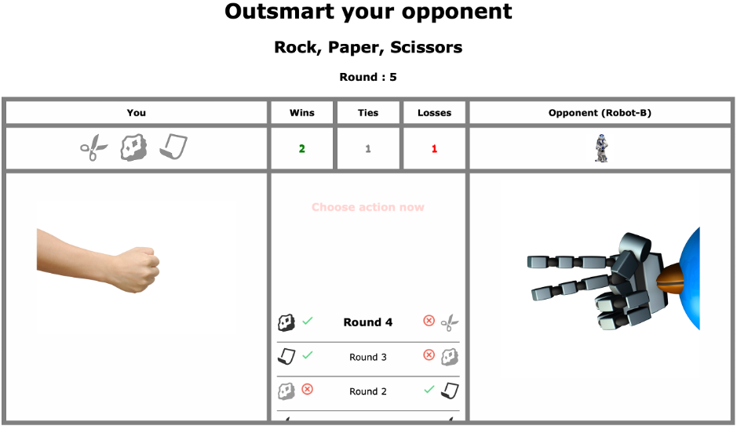
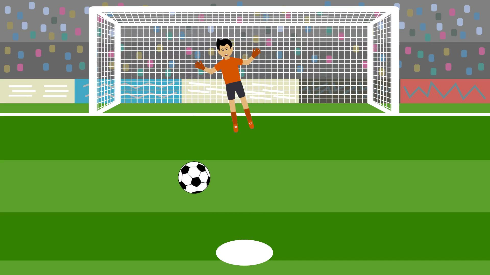

```{r setup, include=FALSE}
knitr::opts_knit$set(root.dir = '../Report')
knitr::opts_chunk$set(echo = FALSE)
knitr::opts_chunk$set(out.width = "\\textwidth")
```

```{r load-packages, include = FALSE}
library(papaja)
library(kableExtra)
require(knitr)
require(citr)
require(bookdown)

# using some functions dplyr, ggpubr, PairedData and sjPlot. Need to be loaded. 
library(plyr)
library(tidyr)
library(dplyr)
library(MASS)
library(ggpubr)
library(afex)
library(PairedData)
library(multcompView)
library(lsmeans)
library(magick)
library(depmixS4)
library(flextable)

```

```{r analysis-preferences}
# Seed for random number generation
set.seed(42)

```


```{r, include=FALSE} 
options(tinytex.verbose = TRUE)
#add_wordcount_filter(NULL, error = FALSE)
```


# Introduction

Being able to transfer previously acquired knowledge to a new domain is one of the hallmarks of human intelligence. This ability relies on important cognitive building blocks, such as an abstract representation of concepts underlying tasks [@Lake2017]. One way to form these representations when the task involves interactions with others, is to build a model of the person we are interacting with that offers predictions of the actions they are likely to take next. There is evidence that people learn such models of their opponents when playing repeated economic games [@stahl1995players]. 

A model of the opponent can help increase performance in a particular game, but learning more general characteristics of an opponent may also help increase performance in other games. In this paper, we are specifically interested in the latter: How do people build and use models of their opponent to facilitate learning transfer? Repeated games, in which players interact repeatedly with the same opponent and have the ability to learn about their opponent's strategies and preferences [@mertens1990repeated] are particularly useful to address this question. The early literature on learning transfer in repeated games has mostly focused on the proportion of people who play normatively optimal (e.g. Nash equilibrium play) or use salient (e.g. risk dominance) actions in later games, having had experience with a similar game environment previously [@ho1998iterated; @knez2000]. As is well-known, a Nash equilibrium means that all players in a game act such that no-one can unilaterally improve their performance by deviating from their strategy. When playing against an opponent with a Nash-optimal strategy, I can do no better than play according to the Nash-equilibrium strategy as well. However, when faced with a player who deviates from the Nash-optimal strategy, I may be able to exploit this and also deviate from this strategy, increasing my performance beyond what is expected at Nash equilibrium. Of course, this comes with some risk, as my own deviation from Nash-optimal play may leave me open to similar exploitation. 

Studies that focused on whether people can learn to exploit deviations from Nash-equilibrium play have mostly looked at the ability of players to detect and exploit action-based learning rules [@spiliopoulos2013strategic; @shachat2004we]. These studies used computer opponents that don't adapt play to their human opponent, mostly consisting of playing each action with a fixed probability (a mixed strategy) or using a pre-determined sequence. Findings showed that humans are capable of adapting to non-Nash-equilibrium play and detect patterns in an opponent's history of play. However, the use of mixed strategies may have limited people's ability to form accurate opponent models.

Instead of thinking of their opponents as drawing random actions from a (non-uniform) probability distribution, people may rather think of their opponents as applying a form of iterated reasoning to determine their next action. The type of reasoning we refer to takes the form of "I believe that you believe that I believe ..." and has been shown to underlie people's decisions in economic games [@camerer2003behavioural;@costa2001cognition]. It also underlies successful models in behavioural economics, such as Level-$k$ and Cognitive Hierarchy models [@camerer2004cognitive], which posit that people assume their opponent applies a limited level of iterative reasoning, taking actions that are best responses to those of their (modelled) opponent. 

In Level-$k$ theory, a level-0 player uses a fixed strategy without explicitly considering the strategy of their opponent. A level-1 player assumes their opponent is a level-0 player, and chooses actions to best respond to the strategy of their opponent, without considering what their opponent might believe that they will play. A level-2 player, on the other hand, takes their opponent's belief about their actions into account, assuming they face a level-1 player, and choosing actions to best respond to the actions of that player. Cognitive Hierarchy theory is based on similar principles, but rather than assuming an opponent always adopts a particular level-$k$ strategy, they are assumed to adopt each of the level-$k$ strategies with a particular probability (i.e., the opponent's strategy is a mixture over pure level-$k$ strategies).

Iterative reasoning strategies can explain non-equilibrium play in a range of games, such as the $p$-beauty contest game [@nagel1995unraveling], dominance solvable games [@camerer2004cognitive], and various standard normal form games [@costa2001cognition]. In the present study, we endow our computer opponents with a limited ability for iterative reasoning and assess whether (1) human players adapt their strategy to exploit this limited reasoning of their opponent, and (2) whether they are able to generalize a learned opponent model to other games. In two experiments, participants face the same opponent (Experiment 1) or the same two opponents (Experiment 2) in three consecutive games: the well-known Rock-Paper-Scissors game, the structurally similar Fire-Water-Grass game, and a less similar Numbers (Experiment 1) or Shootout (Experiment 2) game. To foreshadow our results, we find evidence that participants transfer the learned strategy of their opponent to other games, and that this transfer is moderated by the sophistication of their opponent and the similarity between the games. Moreover, using computational modelling, we find evidence that participants switch from relying on an opponent model in the early stages of the games, to a more habitual and cognitively less demanding strategy in the later stages of the games.

# Experiment 1
In the first experiment, we aim to test learning transfer by making participants face the same computer opponent with a limited level of iterative reasoning in three sequential games that vary in similarity. If participants are able to learn the limitations of their opponent's iterative reasoning and generalize this to new games, their performance in (the early stages of) later games should be higher than expected if they were to completely learn a new strategy in each game. 

## Methods


### Participants and Design
A total of 52 (28 female, 24 male) participants were recruited on the Prolific Academic platform. The mean age of participants was 31.2 years. Participants were paid a fixed fee of £2.5 plus a bonus dependent on their performance (£1.06 on average). The experiment had a 2 (computer opponent: level 1 or level 2) by 3 (games: rock-paper-scissors, fire-water-grass, numbers) design, with repeated measures on the second factor. Participants were randomly assigned to one of the two levels of the first factor. 

### Tasks
Participants played the three games against their computer opponent. These games were Rock-Paper-Scissors, Fire-Water-Grass, and the Numbers game. A typical Rock-Paper-Scissors game (hereafter RPS) is a 3x3 zero-sum game, with a cyclical hierarchy between the two player's actions: rock blunts scissors, paper wraps rock, and scissors cut paper. If one player chooses an action which dominates their opponent's action, the player wins (receives a reward of 1) and the other player loses (receives a reward of -1). Otherwise it is a draw and both players receive a reward of 0. RPS has a unique mixed-strategy Nash equilibrium, which consists of each player in each round randomly selecting from the three options with uniform probability. 

The Fire-Water-Grass (FWG) game is identical to RPS in all but action labels: Fire burns grass, water extinguishes fire, and grass absorbs water. We use this game as we are interested in whether learning is transferred in a fundamentally similar game where the only difference is in the label of the possible actions. This should make it relatively easy to generalize knowledge of the opponent's strategy, provided this knowledge is on a sufficiently abstract level, such as knowing the opponent is a level-1 or level-2 player. Crucially, learning simple contingencies such as "If I played rock on the previous round, playing scissors next will likely result in a win", is not generalizable to this similar game, as these contingencies are tied to the labels of the actions. 

The Numbers game is a generalization of RPS. In the variant we use, 2 participants concurrently pick a number between 1 and 5. To win in this game, a participant needs to pick a number exactly 1 higher than the number chosen by their opponent. For example, if a participant thinks their opponent will pick 3, they ought to choose 4 to win the round. To make the strategies cyclical as in RPS, the game stipulates that the lowest number (1) beats the highest number (5), so if the participant thinks the opponent will play 5, then the winning choice is to pick 1. This game has a structure similar to RPS in which every action is dominated by exactly one other action. All other possible combinations of choices are considered ties. Similar to RPS and FWG, the mixed-strategy Nash equilibrium is to randomly play each action with equal probability.

The computer opponent was programmed to use either a level-1 or level-2 strategy in all the games. A level-1 player is defined as a player who best responds to a level-0 player. A level-0 player plays in a non-strategic way and does not consider their opponent's actions. Here, we assume a level-0 player simply repeats their previous action. There are other ways to define a level-0 player. For instance, as repeating their action if it resulted in a win and choosing randomly from the remaining actions otherwise, or choosing randomly from all actions. As a best response to a uniformly random action is itself a random action, defining a level-0 player in such a way would make a level-1 opponent's strategy much harder to discern. Because we are mainly interested in generalization of knowledge of an opponent's strategy to other games, which requires good knowledge of this strategy, we opted for this more deterministic formulation of a level-0 player. The level-2 computer opponent assumes in turn that the participant is a level-1 opponent, playing according to the strategy just described. To make the computer opponent's strategy not too obvious, we introduced some randomness in actions of computer opponent, making them play randomly in 10\% of all trials. Note that at all levels, the strategies are contingent on the actions taken in the previous round. The choice of this type of strategy is consistent with evidence that humans strategically use information from last round play of their opponents in zero-sum games [@batzilis; @wang2014social]. Table \ref{tab:table-actions} shows an example of the computer opponent's actions in response to the previous round play.

```{r table-actions, warning = FALSE, ft.align="center", tab.id='table-actions', label='table-actions'}
library(flextable)
df <- data.frame( c("Paper","Scissors","Rock","..."),
                  c("Rock","Scissors","Paper","..."),
                  c("Scissors","Rock","Paper","..."),
                  c("Scissors","Paper","Rock","..."))
colnames(df) <- c("Human action t-1","Computer action t-1","Computer level-1 action t", "Computer level-2 action t")

knitr::kable(df,booktabs = TRUE,
  caption = 'Example of how a level-1 and level-2 computer agent plays in response to actions taken in the previous round', ) %>% kable_styling(latex_options="scale_down")
# df <- flextable(df)
# df <- set_caption(df, "Example of how a level-1 and level-2 computer agent plays in response to actions taken in the previous round")
#   autonum = run_autonum(seq_id = "tab", bkm = "actions"))

# df <- autofit(df)
# df
```


<!-- \begin{table}[bth!] -->
<!-- \caption{Example of how a level-1 and level-2 computer agent plays in response to actions taken in the previous round.} -->
<!-- \centering -->
<!-- \label{table:1} -->
<!-- \begin{tabular}{||c c | c c||} -->
<!--  \hline -->
<!--  Human action $t-1$ & Computer action $t-1$  & Computer level-1 action $t$ & Computer level-2 action $t$ \\ [0.5ex] -->
<!--  \hline\hline -->
<!--  Paper & Rock & Scissors & Scissors \\ -->
<!--  Scissors  & Scissors & Rock & Paper \\ -->
<!--  Rock & Paper & Paper & Rock \\ -->
<!--  ... & ... & ... & ... \\ [1ex] -->
<!--  \hline -->
<!-- \end{tabular} -->
<!-- \end{table} -->

### Procedure

Participants were informed they would play three different games against the same computer opponent. Participants were told that the opponent cannot cheat and will choose its actions simultaneously with them, without prior knowledge of the participant's choice. After providing informed consent and reading the instructions, participants answered a number of comprehension questions. They then played the three games against their opponent in the order RPS, FGW, and Numbers. An example of the interface for the RPS game is provided in Figure \ref{fig:feedback-rps-exp2}. On each round, the human player chooses an action, and after a random delay (between 0.5 and 3 seconds) is shown the action chosen by the computer opponent and the outcome of that round. A total of 50 rounds of each game was played with the player's score displayed at the end of each game. The score was calculated as the number of wins minus the number of losses. Ties did not affect the score. In order to incentivise the participants to maximise the number of wins against their opponent, players were paid a bonus at the end of the experiment proportional to their final score (each point was worth £0.02). After playing all the games, participants were asked questions about their beliefs about the computer opponent, related to whether they thought they learned their opponent's strategy, and how difficult they found playing against their opponent. They were then debriefed and thanked for their participation.

```{r feedback-rps-exp2,fig.cap = "Screenshot of the Rock-Paper-Scissors game in Experiment 2. Shown here is the feedback stage, after both the human (left) and computer (right) players have chosen their action. The interface was similar in Experiment 1, but excluded the history of game play in the center panel.", fig.align='center'}



```

```{r load-exp1-data, include=FALSE}

dat1 <- read.csv("../data20180719.csv") 

# transform 'winner' variable in numeric score
dat1$score <- recode(dat1$winner, human = 1, tie = 0, ai = -1)
# create a new variable 'block' with round 1...25 = block 1 and round 26...50 as block 2
dat1$block <- factor(as.numeric(cut(dat1$round,2)),labels =c("first half", "second half"))

# create a new variable "game.f" as a factor variable of games
dat1$game.f <- factor(dat1$game, labels = c("RPS","FWG","Numbers"),levels=c("rps","fwg","numbers"))

#Group data by human_id and calculate mean score per block of each game.
dat2 <- dat1 %>% 
  group_by(human_id,condition,game,block,game.f) %>% 
      summarize(block_score = mean(score))

# Group data by game and ID
dat3 <- group_by(dat2, human_id,game.f,game) %>% summarise(game_score = mean(block_score))
# head(dat3,6)

# Subsetting scores data by game
rps <- subset(dat3,  game.f == "RPS",game_score)
fwg <- subset(dat3,  game.f == "FWG",game_score)
num <- subset(dat3,  game.f == "Numbers",game_score)
# head(rps,6)
```

```{r exp1-avg-scores-game, fig.cap = "Performance per game and block across conditions in Experiment 1. Points are scores of individual participants and boxes reflect the 95\\% confidence intervals of the mean (center line equals the mean).", fig.align="center", fig.width=8, fig.height = 4}
# Plot average  scores per game

dat2 %>%
  mutate(game = factor(game)) %>%
  mutate(game = forcats::fct_recode(game, RPS = "rps", FWG = "fwg", Numbers = "numbers")) %>%
  mutate(game = factor(game, levels = c("RPS", "FWG", "Numbers"))) %>%
  mutate(condition = factor(condition, levels = c("Level1", "Level2"))) %>%
  mutate(condition = forcats::fct_recode(condition, "Level 1" = "Level1", "Level 2" = "Level2")) %>%
  ggplot(aes(x = game, y = block_score, colour = block)) + stat_summary(fun.data = "mean_ci", position = position_dodge2(width=.8), geom = "crossbar")  + geom_point(position=position_jitterdodge(), alpha=.4) + ylab("Score") + xlab("Game") + facet_grid(. ~ condition) + theme_apa() + geom_hline(yintercept = 0, lty=2)


```

## Results

First, we focus on participants scores in each game (see Figure \ref{fig:exp1-avg-scores-game}). On average, participants obtained the lowest score in the RPS game ($M = 0.289$, $SD = 0.348$), followed by Numbers ($M = 0.31$, $SD = 0.347$). Participants' performance was highest in the FWG game ($M = 0.454$, $SD = 0.354$). Scores in each game were significantly different from 0, the expected score of uniformly random play (RPS: $t(51) = 7.26$, $p < .001$;  FWG:  $t(51) = 10.04$ , $p < .001$; Numbers: $t(51) = 7.17$, $p < .001$). As uniformly random play is the Nash equilibrium, this indicates successful deviation from a Nash-optimal strategy. 

<!-- To assess learning within and between games, we used a 2 (condition: Level 1, Level 2) by 3 (game: RPS, FWG, Numbers) by 2 (block: first half, second half) repeated-measures ANOVA, with the first factor varying between participants. This showed a main effect of Game ($F(2,100) = 8.54$, $\eta^{2}  = 0.05$,  $p < .001$), indicating that average scores varied significantly over the games. Post-hoc pairwise comparisons showed that performance in the FWG game was significantly higher than in the RPS game ($t(100) =3.78$, $p < .001$) and the Numbers game ($t(100) = 3.32$ , $p = .002$). The score in RPS was not significantly different from the score in Numbers ($t(100) = 0.45$ , $p = .65$). The main effect of Block ($F(1,50) = 22.51$ ,  $\eta^{2} = 0.03$, $p < .001$) shows that the score in the first half of each game ($M = 0.29$) was significantly lower than in the second half ($M = 0.40$), which indicates within-game learning. The main effect of Condition ($F(1,50) = 5.44$, $\eta^{2} = 0.05$, $p = .024$) indicates that scores were higher against the level-1 player ($M = 0.43$) than against the level-2 player ($M = 0.27$). Thus, it appears that is was harder for participants to exploit the strategy of the more sophisticated level-2 opponent than the comparatively less sophisticated level-1 opponent. -->
```{r MIXEDexp1, include = FALSE, warning=FALSE}

# tmp <- afex::aov_car(
#   block_score ~ game.f*condition*block + Error(human_id/(game.f*block))
#   , data=dat2
#   , type = 3)

#apa_lm1 <- apa_print(exp1_early_anova)

#means.int2 <- lsmeans(exp1_early_anova, specs = c("game.f","condition"))
#trans26 <- summary(means.int2, infer = c(TRUE,TRUE),level = .95, adjust = "holm",ref=c("FWG","Numbers"))
                                    
mod1 <- mixed(block_score ~ game.f*condition*block + (1 | human_id),data=dat2,check_contrasts = FALSE, type = 3, method = "KR")
#summary(mod1)
mod1

mod.lsm <- lsmeans(mod1, ~ game.f*condition, adjust="holm")

#contrast(mod.lsm, "consec",simple = "each",combine = TRUE, adjust = "tukey")
#contrast(mod.lsm, interaction = c("game.f", "condition"))


# Get effect sizes from F values of mixed effect model
library(effectsize)
F_to_eta2(12.9, 2, 250)
F_to_eta2(5.44, 1, 50)
F_to_eta2(15.16, 1, 250)
F_to_eta2(4.52, 2, 250)

```
To assess learning within and between games, we estimate a linear mixed-effects model with score as the dependent variable, and Condition (Level 1 or Level 2), Game (RPS, FWG, Numbers) and Block (first-half , second-half) as independent variables, including all main effects and interactions. The model included random intercepts for participants. The results show a main effect of Game ($F(2,250) = 12.90$, $\eta^{2}  = 0.09$,  $p < .001$). Post-hoc pairwise comparisons show that performance in the FWG game was significantly higher than in the RPS game ($t(100) =3.78$, $p < .001$) and the Numbers game ($t(100) = 3.32$ , $p = .002$). The score in RPS was not significantly different from the score in Numbers ($t(100) = 0.45$ , $p = .65$). The main effect of Block ($F(2,250) = 15.16$ , $\eta^{2} = 0.06$, $p < .001$) shows that the score in the first half of each game ($M = 0.29$) was significantly lower than in the second half ($M = 0.40$), which indicates within-game learning. The main effect of Condition ($F(1,50) = 5.44$, $\eta^{2} = 0.10$, $p = .024$) indicates that scores were higher against the level-1 player ($M = 0.43$) than against the level-2 player ($M = 0.27$). Thus, it appears that is was harder for participants to exploit the strategy of the more sophisticated level-2 opponent than the comparatively less sophisticated level-1 opponent. There was also an interaction between Game and Condition ($F(2,250) = 4.52$ ,  $\eta^{2} = 0.03$, $p = .01$). Post-hoc pairwise comparisons ($p$-values adjusted using Holm method for multiple comparisons) show that, for participants facing level-1 opponents, scores on the FWG game were significantly higher than those for both RPS ($t(250) = 3.85$ , $p = .002$), and Numbers ($t(250) = 3.79$ , $p = .002$). For participants facing level-2 opponents however, there was no significant difference between scores on the three games.


```{r exp1-3factor-plot, include= FALSE, fig.cap = "Performance in early rounds (2-6) per game and block across conditions in Experiment 1. Points are scores of individual participants and boxes reflect the 95\\% confidence intervals of the mean (center line equals the mean).", fig.align = "center", fig.width=8, fig.height=4}

# Plot results by game and block (for all 3 games, learning is happening) 
dat2 %>%
  mutate(game = forcats::fct_recode(as.factor(game), RPS = "rps", FWG = "fwg", Numbers = "numbers")) %>%
  mutate(condition = factor(condition, levels = c("Level1", "Level2"))) %>%
  mutate(condition = forcats::fct_recode(condition, "Level 1" = "Level1", "Level 2" = "Level2")) %>%
  ggboxplot(x = "game", y = "block_score", palette = c("#00AFBB", "#E7B800"),order = c("RPS", "FWG","Numbers"), fill="block", ylab = "Percentage score", xlab = "Games") +  facet_grid(. ~ condition)
```


## Learning transfer

As a measure for learning transfer, we focus on participants’ scores in the initial 5 rounds after the first round (rounds 2-6) of each game (see Figure \ref{fig:exp1-early-score-by-opp}). We exclude the very first round as the computer opponent plays randomly here and there is no opportunity yet for the human player to exploit their opponent's strategy. Players with no knowledge of their opponent's strategy are expected to perform at chance level in these early rounds. Positive scores in rounds 2-6 reflect generalization of prior experience. The FWG early score score is significantly higher than 0 ($t(148.85) = 4.584$, $p < .001$). This is also the case for the Numbers game ($t(148.85) = 3.00$, $p = .009$). We did not expect positive scores for the RPS game, as it was the first game played and there was no opportunity for learning about the opponent's strategy. Scores in this game were indeed not significantly different from 0 ($t(148.85) = 1.04$ , $p = .89$).
```{r exp1-early-rounds, include=FALSE}
dat_26 <- subset(dat1,round >1 & round <7, drop =TRUE)
exp1_dat2_6 <- dat_26 %>% 
  group_by(human_id,condition,game.f,confidence,difficulty) %>% 
      summarise(early_score = mean(score))

# Check group means and SDs by game and condition
group_by(exp1_dat2_6, game.f,condition) %>%
  summarise(
    count = n(),
    mean = mean(early_score, na.rm = TRUE),
    sd = sd(early_score, na.rm = TRUE)
    )

library(afex)

# setting contrast to compare early score between games across levels 
exp1_dat2_6$game.f <- as.factor(exp1_dat2_6$game.f)
exp1_dat2_6$condition <- as.factor(exp1_dat2_6$condition)

contrasts(exp1_dat2_6$game.f) <- cbind(c(1,-1,0),c(0,-1,1))
contrasts(exp1_dat2_6$condition) <- c(1,-1)

# Mixed effects Model: Random intercept for participants
lme_early <- mixed(early_score ~ game.f*condition + (1 | human_id),data=exp1_dat2_6,check_contrasts = FALSE, type = 3, method = "KR")
summary(lme_early)

lme_early

```


```{r exp1-early-score-by-opp, fig.cap = "\\label{ref:figure4-caption}Performance in early rounds (2-6) per game and block across conditions in Experiment 1. Points are scores of individual participants and boxes reflect the 95\\% confidence intervals of the mean (center line equals the mean).", fig.align ='center', fig.width=8, fig.height=4}

exp1_dat2_6 %>%
  mutate(game = factor(game.f)) %>%
  mutate(game = forcats::fct_recode(game, Numbers = "Numbers")) %>%
  mutate(game = factor(game, levels = c("RPS", "FWG", "Numbers"))) %>%
  mutate(condition = factor(condition, levels = c("Level1", "Level2"))) %>%
  mutate(condition = forcats::fct_recode(condition, "Level 1" = "Level1", "Level 2" = "Level2")) %>%
  ggplot(aes(x = game, y = early_score, colour=game)) + stat_summary(fun.data = "mean_ci", geom = "crossbar")  + geom_jitter(alpha=.4) + ylab("Early score") + xlab("Game") + facet_grid(. ~ condition) + theme_apa() + geom_hline(yintercept = 0, lty=2) + scale_color_discrete() + theme(legend.position = "none")

```

Next, we explore whether learning transfer is moderated by the type of opponent and game similarity. We expected better transfer between more similar games (i.e. better transfer from RPS to FWG than from RPS/FWG to Numbers), and worse transfer for the more sophisticated level-2 agent. Figure \ref{fig:exp1-early-score-by-opp} indicates that the pattern over the games is indeed dissimilar between level-1 and level-2 opponents. We estimates a linear mixed-effects model with the early round score as the dependent variable, and Condition (Level 1 or Level 2) and Game (RPS, FWG, Numbers), as well as their interaction, as independent variables. The model included random intercepts for participants. The results indicated a main effect of Game ($F(2,100) = 3.35$, $p = .04$), but no effect for condition. Further investigation of the effects of game on early score using planned contrasts revealed that early scores in the FWG games are significantly higher than in the RPS ( $t(99.99) = -2.32$, $p = 0.02$).

<!-- To explore this, we used a 2 (Condition: Level 1, Level 2) by 3 (Game: RPS, FWG, Numbers) repeated measures ANOVA with the first factor varying between participants. There was a main effect of Game ($F(1.84,91.77) = 3.35$, $\eta^{2}  = 0.04$,  $p = .043$, Greenhouse-Geisser correction applied to the degrees of freedom to correct for non-sphericity). -->

We next ran statistical tests on early round scores by game and opponent, against the null hypothesis of 0 (no transfer). For level-1 facing players, there is evidence of learning transfer from RPS to both FWG ($t(150) = 3.96$, $p < .001$) and Numbers ($t(150) = 3.74$, $p < .001$). For level-2 facing players, there is evidence for transfer from RPS to the similar game FWG, albeit scores are lower than for level-1 player ($t(150) = 2.48$, $p = .01$) but not to the dissimilar game of Numbers. 

## Discussion

The results of Experiment 1 indicate that participants were able to learn successful strategies which exploited the deviation from Nash-optimal play of their opponents. Moreover, they were able to transfer knowledge about their opponent to other games, but this was moderated by the type of game. There was evidence of transfer from the RPS game to the similar FWG game for both opponents. However, transfer to the dissimilar Numbers game was only evident for participants facing a level-1 opponent. 

```{r ANOVA early exp1, include = FALSE, warning=FALSE}

exp1_early_anova <- afex :: aov_car(
  early_score ~ game.f*condition + Error(human_id/(game.f))
  , data=exp1_dat2_6
  , type = 3)
                                    
exp1_early_anova
#apa_lm1 <- apa_print(exp1_early_anova)

means.int2 <- lsmeans(exp1_early_anova, specs = c("game.f","condition"))
trans26 <- summary(means.int2, infer = c(TRUE,TRUE),level = .95, adjust = "holm",ref=c("FWG","Numbers"))

```
  
```{r table-early-scores, include = FALSE, results = "asis"}
# apa_table(trans26, caption = "Average early round scores by game and condition in first experiment")
```


# Experiment 2

In Experiment 2, we aimed to obtain a stronger test of learning transfer. Instead of facing a single level-1 or level-2 opponent throughout all games, participants now faced both types of opponent. To perform well against both opponents, participants would need to learn distinct strategies against these opponents. To reduce effects of increased memory load due to facing distinct opponents, we provided participants access to the history of play against an opponent within each game (see Figure \ref{fig:feedback-rps-exp2}). Finally, we changed the third game to a penalty Shootout game, with participants aiming to score a goal and opponents playing the role of goal keepers. Whilst this game has the same number of actions as the first two (aim left, center, or right), it is strategically dissimilar. Unlike the Numbers game in Experiment 1, the Shootout game does not have a cyclical hierarchy between actions, making it harder to win through a heuristic based on this cyclicity.

## Methods 
### Participants & Design 
A total of 48 participants (21 females, 28 males, 1 unknown) were recruited via the Prolific platform, none of which took part in Experiment 1. The average age was 30.2 years, and the mean duration to complete the task was 39 minutes. Participants received a fixed fee of £2.5 for completing the experiment and a performance dependent bonus (£1.32 on average).

### Tasks
Participants played three games: Rock-Paper-Scissors (RPS), Fire-Water-Grass (FWG), and the penalty Shootout game. The first two games were identical to the ones used in Experiment 1. In the Shootout game, participants took the role of the a football (soccer) player in a penalty situation, with the computer opponent taking the role of the goalkeeper. Players had the choice between three actions: shooting the football to the left, right, or centre of the goal. Similarly, the goalkeeper chooses between defending the left, right, or centre of the goal. If participants shoot in a different direction than where the goalkeeper defends, they win the round and the goalkeeper loses. Otherwise, the goalkeeper catches the ball and the player loses the round. There is no possibility of ties in this game. Figure \ref{fig:screenshot-shootout} shows a snapshot of play in the Shootout game. What makes this game different to the other games is that there are now two ways to beat the opponent: if the shooter thinks their opponent is going to choose to defend "right" in the next round, they can win by either choosing to shoot "left" or "center". A level-1 shooter who thinks that their goalkeeper opponent will repeat their last action has thus two possible best responses. A level-1 goalkeeper, however, has only a single best response (defending where their opponent aimed in the last round). A level-2 goalkeeper, who believes their opponent is a level-1 shooter, will have two best responses however. We programmed the level-2 computer player to choose randomly between these two best responses.

As in Experiment 1, all the games have a unique mixed-strategy Nash equilibrium consisting of uniformly random actions. If participants follow this strategy, or simply don't engage in learning how the opponent plays, they would score 0 on average against both level-1 and level-2 players. Evidence of sustained wins would indicate that participants have learned to exploit patterns in their opponents' play. 

```{r screenshot-shootout, fig.cap = "Screenshot of the shootout game", fig.align='center'}


```

### Procedure 
Participants played 3 games sequentially against both level-1 and level-2 computer opponents. As in Experiment 1, the computer opponents retained the same strategy throughout the 3 games. Participants faced each opponent twice in each game. Each game was divided into 4 stages, numbered 1 to 4, consisting of 20, 20, 10, and 10 rounds respectively for a total of 60 rounds per game. Participants started by facing one of the opponents in stage one, then the other in stage two. This was repeated in the same order in stages 3 and 4. Which opponent they faced first was counterbalanced. All participants engaged in the three games (RPS, FWG and Shootout) in this exact order, and were aware that their opponent could not cheat and chose their action simultaneously with the player, without knowing their choices beforehand. In order to encourage participants to think about their next choice, a countdown timer of 3 seconds was introduced at the beginning of each round. During those 3 seconds, participants could not choose an action and had to wait for the timer to run out. A random delay between 0.5 and 3 seconds was again introduced before the choice of the computer agent was revealed, as a way of simulating a real human opponent's decision time. After each round, participants were given detailed feedback about their opponent's action and whether they won or lost the round. Further information about the history of play in previous rounds was also provided and participants could scroll down to recall the full history of each interaction against an opponent in a particular stage of a game. The number of wins, losses and ties in each game were displayed at the top of the screen, and this scoreboard was reinitialised to zero at the onset of a new stage game.


```{r load_exp2_data , include=FALSE}
dat_int <- read.csv(file = "../Experiment_2/dat_int_exp2.csv")
```
## Results
Participants' scores are depicted in Figure \ref{fig:exp2-score-by-opp}. The RPS game had the lowest average score per round ($M = 0.194$, SD = 0.345) followed by FWG ($M = 0.27$, SD = 0.394) and finally the Shootout game ($M = 0.289$, SD = 0.326).^[A higher score in the Shootout game is expected as there are 2 out of three possible winning actions, compared to one out of three in RPS and FWG. Indeed, a player not aiming to uncover the opponent’s strategy and thus choosing to play randomly should be expected to have on average score per round of 0 in both RPS and FWG, and 0.33 in the Shootout game. To make the scores more comparable, and because we are interested in player’s performance that is not due to chance, we will adjust all scores in the Shootout game by subtracting the average score per round of a random strategy (0.33).] Using one-sample t-tests on adjusted scores, we reject the null hypothesis of random play in all three games (RPS: $t(49) = 6.26$, $p < .001$; FWG: $t(49) = 7.25$, $p < .001$; Shootout: $t(49) = 13.61$, $p < .001$).

```{r Anova exp 2, include= FALSE}
exp2_anova <- afex::aov_car(
  int_score ~ (game.f*interaction_lvl*condition.f*opp_type) + Error(human_id/(game.f*interaction_lvl*opp_type))
  , data = dat_int
  , type = 3
)

(ls0 <- lsmeans(exp2_anova, "game.f", by = "opp_type"))
(ls0 <- update(pairs(ls0, reverse = TRUE), by=NULL, adjust = "holm"))
apa_lm <- apa_print(exp2_anova)

```


```{r exp2-score-by-opp, fig.cap = "\\label{fig:exp2-score-by-opp}Performance per game and interaction across opponents in Experiment 2. Points are scores of individual participants and boxes reflect the 95\\% confidence intervals of the mean (center line equals the mean).", fig.align = "center", fig.width=8, fig.height=4}

# Plot results by game and block (for all 3 games, learning is happening) 
dat_int %>%
  mutate(game.f = forcats::fct_recode(game.f, Shootout = "SHOOT")) %>%
  mutate(game.f = factor(game.f, levels = c("RPS", "FWG", "Shootout"))) %>%
  mutate(opp_type = forcats::fct_recode(as.factor(opp_type), "Level 1" = "Level_1", "Level 2" = "Level_2")) %>%
  mutate(encounter = interaction_lvl) %>%
  ggplot(aes(x = game.f, y = int_score, colour = encounter)) + stat_summary(fun.data = "mean_ci", position = position_dodge2(width=.8), geom = "crossbar")  + geom_point(position=position_jitterdodge(), alpha=.4) + ylab("Score") + xlab("Game") + facet_grid(. ~ opp_type) + theme_apa() + geom_hline(yintercept = 0, lty=2)

# p3 <- ggerrorplot(dat_int, x = "game.f", y = "int_score", group = 1, color="game.f", desc_stat = "mean_ci",palette = c("#00AFBB", "#E7B800", "#FC4E07"), order = c("RPS", "FWG","SHOOT"), ylab = "Average Scores per game", xlab = "Games")
# 
# p3 + facet_grid(. ~ opp_type)

#p4 <- ggboxplot(dat_int, x = "game.f", y = "int_score", palette = c("#00AFBB", "#E7B800"),order = c("RPS", "FWG","SHOOT"), fill="interaction_lvl",ylab = "Percentage score", xlab = "Games", legend.title = "interaction level")

#p4 + facet_grid(. ~ opp_type)


```

```{r exp2-anova, results = "asis", echo=FALSE, warning=FALSE}
# apa_table( apa_lm$table, caption = "ANOVA results for experiment 2", escape = FALSE)
```

```{r, include = FALSE}

xp2_anova <- afex::aov_car(
  int_score ~ (game.f*interaction_lvl*condition.f*opp_type) + Error(human_id/(game.f*interaction_lvl*opp_type))
  , data = dat_int
  , type = 3
)

mod2 <- mixed(int_score ~ game.f*interaction_lvl*condition.f*opp_type + (1 | human_id),data=dat_int,check_contrasts = FALSE, type = 3, method = "KR")
#summary(mod2)
mod2

F_to_eta2(15.32,2,528)
F_to_eta2(5.78,2,528)
```


<!-- To explore whether learning occurred within and between games, we performed a two (Condition: level-1 first, level-2 first) by two (Opponent type: level-1 or level-2) by three (Game: RPS, FWG, Shootout) by two (Encounter: first or second) repeated-measures ANOVA, with the first factor varying between participants. This showed a main effect of Game ($F(1.85,88.7) = 11.81$, $\eta^{2} = 0.04$,  $p < .001$). Post-hoc pairwise comparisons between games ($p$-values adjusted using Holm method for multiple comparisons) indicate performance in the games increased steadily throughout the experiment, with FWG performance significantly higher than RPS ($t(96) =2.53$, $p = .025$), and performance in the Shootout game significantly higher than in FWG ($t(96) = 2.32$, $p = .025$). Whilst the ANOVA shows no main effect of Condition, Opponent type, or Encounter, there was a significant interaction between Game and Opponent type ($F(1.7, 81.82) = 5.31$ ,$\eta^{2} = 0.02$,  $p = .01$). Follow-up analysis shows that when facing level-1 agents, scores increased steadily after each game, with FWG score significantly higher than RPS ($t(191) = 2.70$, $p = .03$) and Shootout scores in turn significantly higher than FWG  ($t(191) = 3.05$, $p = .01$). There was no significant difference between average scores on any two games when facing level-2 agents however. -->

To explore whether learning occurred within and between games, we estimated a linear mixed-effects model, with score as the dependent variable and Condition (level-1 first, level-2 first), Opponent type (level-1 or level-2), Game (RPS, FWG, Shootout) and Encounter (first or second) as the independent variables, including all main effects and interactions. The model included random intercepts for participants. We found a main effect of Game ($F(2,528) = 15.32$, $\eta^{2} = 0.04$,  $p < .001$). Post-hoc pairwise comparisons between games ($p$-values adjusted using Holm method for multiple comparisons) indicate performance in the games increased steadily throughout the experiment, with FWG performance significantly higher than RPS ($t(96) =2.53$, $p = .025$), and performance in the Shootout game significantly higher than in FWG ($t(96) = 2.32$, $p = .025$). Whilst the model shows no main effect of Condition, Opponent type, or Encounter, there was a significant interaction between Game and Opponent type ($F(2, 528) = 5.78$ ,$\eta^{2} = 0.02$,  $p = .003$). Follow-up analysis differentiating performance by type of opponent faced shows that when facing level-1 agents, scores increased steadily after each game, with FWG score significantly higher than RPS ($t(191) = 2.70$, $p = .03$) and Shootout scores in turn significantly higher than FWG  ($t(191) = 3.05$, $p = .01$). There was no significant difference between scores on games when facing level-2 agents however.

## Learning transfer
To measure transfer between games, we again focus on participants' scores in the initial 5 rounds after the first round (rounds 2-6) of each game and only during the first time they interact with an opponent in a game (see Figure \ref{fig:exp2-early-score-by-opp}). We estimated a linear mixed-effects model with the early round scores as the dependent variable, and Condition (level-1 first, level-2 first), Opponent type (level-1 or level-2) and Game (RPS, FWG, Shootout) as independent variables, including all main effects and interactions. The model also included random intercepts for participants. We found a main effect of Game ($F(2,240) = 6.57$, $p = .002$). The effect of game reflects early scores on FWG being significantly higher than on RPS ($t(240) = 3.01$, $p = .005$) as well as scores on shootout being significantly higher than RPS ($t(240) = 3.25$, $p = .003$). We also found an interaction effect between Game and Opponent type ($F(2,240) = 3.34$,  $p = .037$). Post-hoc pairwise comparisons (p-values adjusted using Holm method for multiple comparisons) show that the difference between early scores in RPS and shootout was mostly driven by participants facing level-1 players (($t(240) = 4.12$, $p < .001$)). No signifcant differences were found between participants facing different opponents in the same game, or between games when facing the same opponent.
```{r, include=FALSE}
dat <- read.csv(file = "../Experiment_2/dat_exp2.csv")
```


```{r, include = FALSE}

#looking at TRIALS 2 to 6 to test robustness of evidence for transfer of learning of opponent strategy #########

dat_26 <- subset(dat,(round >1 & round < 7) & (interaction_lvl == "first interaction" ), drop =TRUE)

exp2_dat2_6 <- dat_26 %>% 
  group_by(human_id,condition.f,game.f,opp_type,confidence,difficulty) %>% 
      summarise(early_score = mean(adj_score))

# Check group means and SDs
group_by(exp2_dat2_6, game.f) %>%
  summarise(
    count = n(),
    mean = mean(early_score, na.rm = TRUE),
    sd = sd(early_score, na.rm = TRUE)
    )
group_by(exp2_dat2_6, game.f,opp_type) %>%
  summarise(
    count = n(),
    mean = mean(early_score, na.rm = TRUE),
    sd = sd(early_score, na.rm = TRUE)
    )
```

```{r exp2-early-score-by-opp, fig.cap = "\\label{ref:figure4-caption}Performance in early rounds (2-6) per game and opponent in Experiment 2. Points are scores of individual participants and boxes reflect the 95\\% confidence intervals of the mean (center line equals the mean).", fig.align ='center', fig.width=8, fig.height=4}
exp2_dat2_6 %>%
  mutate(game = factor(game.f)) %>%
  mutate(game = forcats::fct_recode(game, Shootout = "SHOOT")) %>%
  mutate(game = factor(game, levels = c("RPS", "FWG", "Shootout"))) %>%
  mutate(opp_type = factor(opp_type, levels = c("Level_1", "Level_2"))) %>%
  mutate(opp_type = forcats::fct_recode(opp_type, "Level 1" = "Level_1", "Level 2" = "Level_2")) %>%
  ggplot(aes(x = game, y = early_score, colour=game)) + stat_summary(fun.data = "mean_ci", geom = "crossbar")  + geom_jitter(alpha=.4) + ylab("Early score") + xlab("Game") + facet_grid(. ~ opp_type) + theme_apa() + geom_hline(yintercept = 0, lty=2) + scale_color_discrete() + theme(legend.position = "none")

  
```

```{r, include = FALSE}
# testing differences between early scores across games 
library(afex)

exp2_dat2_6$game.f <- as.factor(exp2_dat2_6$game.f)
exp2_dat2_6$opp_type <- as.factor(exp2_dat2_6$opp_type)
exp2_dat2_6$condition.f <- as.factor(exp2_dat2_6$condition.f)

# Set contrasts
contrasts(exp2_dat2_6$game.f) <- cbind(c(1,-1,0),c(0,-1,1))
contrasts(exp2_dat2_6$opp_type) <- c(1,-1)
contrasts(exp2_dat2_6$condition.f) <- c(1,-1)

# Random intercecprt for participants
lme_early2 <- mixed(early_score ~ game.f*opp_type*condition.f + (1 | human_id),data=exp2_dat2_6,check_contrasts = FALSE, type = 3, method = "KR")
summary(lme_early2)

lme_early2


lsmeans(lme_early2, pairwise~game.f*opp_type, adjust="holm")
# lsmeans(lme_early2, pairwise~game.f, adjust="holm")


```
<!-- We performed a two (Condition: level-1 first, level-2 first) by two (Opponent type: level-1 or level-2) by three (Game: RPS, FWG, Shootout) repeated-measures ANOVA, with the first factor varying between participants. This showed a main effect of Game ($F(1.94,92.98) = 7.67$, $\eta^{2} = 0.04$,  $p < .001$). **MS: Again, if there is no interaction, there might not be justification for running tests per opponent and game ** --> 

We then ran statistical tests on early round scores by game and opponent against the null hypothesis of 0 (no transfer). For level-1 facing players, there is evidence of learning transfer from RPS to both FWG ($t(271) = 4.99$, $p < .001$) and Shootout ($t(271) = 6.66$, $p < .001$). For level-2 facing players, there is evidence for transfer from RPS to the similar game FWG, albeit scores are lower than for level-1 player ($t(271) = 4.41$, $p < .001$). Unlike in Experiment 1, there is also evidence of transfer to the dissimilar Shootout game ($t(271) = 3.22$, $p = .004$). The early round scores in the similar FWG games for level-1 and level-2 facing players are not significantly different from each other. However, the score of the players facing the level-1 opponent in Shootout is higher than that of players facing level-2 opponents ($t(144) = 2.45$, $p = 0.01$).


## Discussion
The results of Experiment 2 confirm earlier findings from Experiment 1 on learning transfer in a situation where participants need to learn about two distinct opponents. As in Experiment 1, participants adapted their strategies to both level-1 and level-2 opponents to exploit deviations from Nash-optimal play. Knowledge about both types of opponents were transferred to both the similar and dissimilar game. This transfer was moderated by the degree of similarity between games, as well as opponent type. The interaction effect showed that transfer to the dissimilar game was easier when facing the less sophisticated agent.

# Computational modelling

To gain more insight into participants' strategies against their computer opponents, we constructed and tested several computational models of strategy learning. The baseline model assumes play is random, and each potential action is chosen with equal probability. Note that this corresponds to the Nash equilibrium strategy. The other models adapted their play to the opponent, either by reinforcing successful actions in each game (reinforcement learning), or by determining the type of opponent through Bayesian learning (Bayesian Cognitive Hierarchy models). We also include the (self-tuning) Expected Weighted Attraction (EWA) model, which is a popular model in behavioural economics.

In the following, we will describe the models in more detail, and provide some intuition into how they implement learning about the game and/or the opponent. Throughout, we use the following notation: In each game $g \in \{\text{RPS},\text{FWG}, \text{Numbers}, \text{Shootout} \}$, on each trial $t$, the participant chooses an action $a_t \in \mathcal{A}_g$, and the opponent chooses action $o_t \in \mathcal{A}_g$, where $\mathcal{A}_g$ is the set of allowed actions in game $g$, e.g. $\mathcal{A}_\text{RPS} = \{R,P,S\}$. The participant then receives reward $r_t \in \{1,0,-1\}$, and the opponent receives $-r_t$. We use the state variable $s_t = \{a_{t-1},o_{t-1}\}$ to denote the actions taken in the previous round $t-1$ by the participant and opponent. The initial state is empty, and we assume that the action at a first encounter of an opponent in a game is chosen at random.

## Reinforcement learning (RL) model
We first consider a model-free reinforcement learning algorithm, where actions that have led to positive rewards are reinforced, and the likelihood of actions that led to a negative reward is lowered. Since the computer players in this experiment based their play on the actions in the previous round, a suitable RL model for this situation is one which learns the value of actions contingent on plays in the previous round, i.e. by defining the state $s_{t}$ as above. The resulting RL model learns a $Q$-value [@watkins1992q] for each state-action pair:
$$Q_{t+1}(s_{t},a_{t}) = Q_{t}(s_{t},a_{t}) + \alpha \left( r_{t}  - Q(s_{t},a_{t}) \right) ,$$
where $Q(s_{t},a_{t})$ is the value of taking action $a$ when in state $s$ at time $t$, and $\alpha \in [0,1]$ the learning rate. For instance, $Q_t(\{R,S\},P)$ denotes the value of taking action  "Paper" this round if the player's last action was "Rock" and the opponent played "Scissors". Actions are taken according to a softmax rule:
$$P_{t}(a|s_t) = \frac{\exp \{ \lambda Q_{t}(a,s_t) \}}{\sum_{a' \in \mathcal{A}_g} \exp \{\lambda  Q_{t}(a',s_t) \}}, $$ 
where the inverse temperature parameter $\lambda$ determines the consistency of the strategy (the higher $\lambda$, the more often the action with the highest $Q$-value is chosen). While this RL model allows the players to compute the values of actions conditional on past play, crucially, it will not be able to transfer learning between games, as each game has a different state space $\mathcal{S}_g$ and action space $\mathcal{A}_g$, and there is no simple way to map states and actions across games. The RL model has two free parameters: the learning rate ($\alpha$) and the inverse temperature ($\lambda$).


## Experience-weighted attraction (EWA) model
The self-tuning Experience Weighted Attraction (EWA) model [@ho2004economics] combines two seemingly different approaches, namely reinforcement learning and belief learning. Belief learning models are based on the assumption that players keep track of their opponent's frequency of past actions, and best respond to that. By contrast, reinforcement learning does not explicitly take into account beliefs about other players, but simply increases the probability of repeating a more rewarding action. The self-tuning EWA model has been shown to perform better than either RL or belief learning alone in various repeated games and has the advantage of having only one free parameter, the inverse temperature of the softmax choice function. The EWA model is based on updating ``Attractions'' for each action over time given a particular state. The attraction of action $a$ at time $t$ given state $s$ is denoted as $A_{t}(a, s)$ and updated as 
$$ A_{t+1}(a,s) =  \frac{\phi(t) \ N(t) \ A_{t}(a,s) + [ \delta_{a}(t) + (1-\delta_{a}(t)) \ I(a_t = a )] \ R(a,o_t) } {\phi(t)N(t) + 1} $$
where $I(x)$ is an indicator function which takes the value 1 if its argument is true and 0 otherwise, and $R(a,o_t)$ is the reward that would be obtained from playing action $a$ against opponent action $o_t$. $R(a,o_t)$ equals the actual obtained reward when $a = a_t$, and otherwise is a counterfactual reward that would have been obtained if a different action were taken. Unlike reinforcement learning, this uses knowledge of the rules of the game to allow reinforcing actions that were not actually taken by the rewards they would have provided. The parameter $\delta$ reflects the weight given to such counterfactual rewards. Setting $\delta = 0$ leads to reinforcement only of actions taken, while positive values of $\delta$ makes the update rule take into account foregone payoffs, which is similar to weighted fictitious play [@cheung1994learning]. $N(t)$ represents an experience weight and can be interpreted as the number of "observation-equivalents" of past experience. We initialise it to 1 so initial attractions and reinforcement from payoffs are weighted equally.

In the earlier version of the EWA model [@camerer1997experience], $\phi$ and $\delta$ were time-invariant free parameters. In the self-tuning EWA model [@ho2004economics], the values of $\delta$ and $\phi$ are learnt from experience. Over time, $\delta$ is updated as
$$\delta_{a}(t) = \begin{cases} 1 & \text{if }  R(a,o_{t}) \geq r_{t}  \\
0 & \text{otherwise} \end{cases}$$ 
The $\phi_{t}$ parameter can be interpreted as a discount of prior experience, modelling either limited agent memory or changes in the game conditions. At the core, $\phi(t)$ depends on a surprise index $S_{p}(t)$: 
$$\phi(t) = 1 - \frac{1}{2}S_{p}(t) ,$$
where $S_{p}(t)$ quantifies how the opponent deviates from past play. It is calculated in turn through the cumulative history of play, across opponent possible actions k, as $h^{k}(t)$:
$$h^{k}(t)= \frac{ \sum_{\tau = 1}^t  I( o_{\tau} = o^k )} {t}, $$ 
as well as an indicator vector of the most recent opponent play:
$$r^k(t) = I(o^k=o_{t}), $$ 
Where $I$ is the indicator function as defined above. To get the surprise index, we simply sum all the squared deviations between the cumulative history vector $h^{k}(t)$ and the immediate history $r^k(t)$:

$$S_{p}(t) = \sum_{k=1}^{|\mathcal{A}_g|} (h^{k}(t) - r^k(t))^2 $$ 

For more details on the self-tuning EWA model, we refer the reader to [@ho2004economics]. As in the RL model above, actions are chosen based on a softmax decision rule:

$$P_t(a,s) = \frac{\exp \{\lambda  A_{t}(a,s) \} }{\sum_{a' \in \mathcal{A}_t} \exp \{ \lambda A_{t}(a',s) \} } $$
The self-tuning EWA has one free parameter: the inverse temperature of the softmax decision rule ($\lambda$). 

## Bayesian Cognitive Hierarchy (BCH) model

In what we call the Bayesian Cognitive Hierarchy (BCH) model, the participant attempts to learn the type of opponent they are facing through Bayesian learning. For present purposes, we assume participants consider the opponent could be either a level 0, level 1, or level 2 player, and start with a prior belief that each of these types is equally likely. They then use observations of the opponent's actions to infer a posterior probability of each type:
$$P(\text{level}=k | \mathcal{D}_{t})  \propto  P(\mathcal{D}_{t}|\text{level}=k ) \times P(\text{level}=k)$$
where $\mathcal{D}_{t} = \{s_1,\ldots,s_t\}$ is the data available at time $t$. The likelihood is defined as
$$P(\mathcal{D}_{t}|\text{level}=k) = \prod_{j=1}^t \left( \theta \frac{1}{|\mathcal{A}_g|} + (1-\theta) f_k(o_j|s_{j})\right)$$
where $f_k(o_t|s_{t}) = 1$ if $o_t$ is the action taken by a level $k$ player when the previous round play was $s_t = (a_{t-1}, o_{t-1})$, and 0 otherwise. Note that the likelihood assumes (correctly) that there is a probability $\theta \in [0,1]$ that the opponent takes a random action. The posterior at time $t-1$ forms the prior at time $t$. We assume a participant chooses an action by using the softmax function over the best response to predicted actions:
$$\begin{aligned} B_t(a) &= \sum_{k = 0}^2 \sum_{o \in \mathcal{A}_g} b(a,o) f_k(o|s_{t})  P(\text{level}=k|\mathcal{D}_{t-1})\\
P_t(a) &= \frac{\exp\{\lambda B_t(a) \}}{\sum_{a' \in \mathcal{A}_g} \exp \{ \lambda B_t(a')\}} \end{aligned}$$
where $b(a,o) = 1$ if action $a$ is a best response to opponent's action $o$ (i.e. it leads to a win).

Unlike the models above, the BCH model allows for between-game transfer, as knowledge of the level of the opponent can be used to generate predictions in games that have not been played before. This generalization is done simply by using the posterior $P(\text{level} = k|\mathcal{D}_T)$ from the previous game as the prior distribution in the next game. However, the participant might also assume that the level of reasoning of their opponent does not generalize over games. This would mean starting with a "fresh" prior $P(\text{level} = k)$ at the start of each game. We hence distinguish between two versions of the BCH model. In the No-Between-Transfer (BCH\_NBT) variant, participants assume a uniform probability of the different levels at the start of each game (and hence do not transfer knowledge of their opponent between games). In the Between-Transfer model (BCH\_BT), participants use the posterior probability over the levels of their opponent as the prior at the start of a new game (i.e. complete transfer of the knowledge of their opponent). Both versions of the BCH model have two free parameters: the assumed probability that the opponent chooses a random action ($\theta$), and the temperature parameter of the softmax function ($\lambda$). 

## Estimation and model comparison
For both experiments, we fitted all models to individual participant data by maximum likelihood estimation using the DEoptim R package [@R-DEoptim]. We use the Bayesian Information Criterion (BIC) to determine the best fitting model for each participant. 
For Experiment 1, we fitted a total of 5 models: a baseline model assuming random play (Nash), the Bayesian Cognitive Hierarchy model allowing transfer between games (BCH\_BT) and without transfer between games (BCH\_NT), as well as a reinforcement learning (RL), and finally a self-tuning EWA model with the same state space (EWA).
In Experiment 2, because participants were interacting with each opponent twice within each game, we need to distinguish between two types of opponent model transfer. We can have transfer *within* games between the first and second interaction with the opponent. In addition, we can also have transfer *between* games, as in e.g. transferring a learned opponent model from RPS to FWG. Therefore, we fitted a total of three versions of the Bayesian Cognitive Hierarchy model: BCH\_BT allows for both within and between game transfer (between game transfer without within game transfer is implausible); BCH\_WT allows only for within-game transfer, but not between game transfer; BCH\_NT allows for no transfer within or between games. As the RL model can't account for between game transfer due to a change in state and action space, we can only have models that allowing for within game transfer (RL\_WT) or with no transfer within games (RL\_NT). Likewise, we fit both a self tuning EWA model with (EWA\_WT) and without (EWA\_NT) within-game transfer. Including the baseline model of random play (Nash), we therefore fitted a total of 8 models for Experiment 2. 


```{r load-comp-mod-distrib, include=FALSE}

exp1_comp_results <- read.csv(file="../exp1_all_results.csv")
exp1_comp_table <- table(exp1_comp_results[, "condition"],c("Nash","BCH_BT","BCH_NT", "RL","EWA")[apply(exp1_comp_results[,c("Random_BIC","Bayes_Tr_BIC","Bayes_No_Tr_BIC","QL_states_BIC","ST_EWA_STATES_BIC")],1,which.min)])

 #write.csv(exp1_comp_table ,file="exp1_comp_table ",row.names = TRUE)

```


```{r exp1-cum-score-plots, include=FALSE}

exp1_dat = read.csv("../exp1_data.csv")

exp1_model_comp <- data.frame()
for(id in unique(exp1_dat$human_id)) {
  tdat <- subset(exp1_dat,human_id == id)
  tot_score <- sum(tdat$score)
  tot_time <- sum(tdat$human_rt)
  early_dat <- subset(tdat,between(tdat$round,2,6) & (game =="fwg"))
  #early_dat <- subset(tdat,between(tdat$round,2,6) & (game =="fwg" | game =="numbers") )
  tr_score <- sum(early_dat$score)
  id_results <- subset(exp1_comp_results, ID == id)
  min_BIC <- apply(id_results[,c("Random_BIC","Bayes_Tr_BIC","Bayes_No_Tr_BIC","QL_states_BIC","ST_EWA_STATES_BIC")],1,min)
  
  best_model <- c("Nash","BCH_BT","BCH_WT", "RL","EWA")[apply(id_results[,c("Random_BIC","Bayes_Tr_BIC","Bayes_No_Tr_BIC","QL_states_BIC","ST_EWA_STATES_BIC")],1,which.min)]
  # 
  exp1_model_comp <- rbind(exp1_model_comp,
                       data.frame(
                         "human_id" = id,
                         "condition" = exp1_dat[exp1_dat$human_id==id,"condition"][1],
                         "Early_game_score" = tr_score,
                         "Total_score" = tot_score,
                         "Best_model" = best_model
                         #"Total_time" = sum(tdat$human_rt),
                       ))
}


datalist = list()
i = 0
new_dat <- setNames(data.frame(matrix(ncol = ncol(exp1_dat), nrow = 0)), colnames(exp1_dat))
for(id in unique(exp1_dat$human_id)) {
  i <- i+1
  tdat <- subset(exp1_dat,human_id == id)
  tdat$part_num <- i
  tdat <- within(tdat, acc_sum <- cumsum(tdat$score))
  datalist[[i]] <- tdat
}

# Merge all datasets into one 
new_dat <- dplyr::bind_rows(datalist)
# or new_dat <- data.table::rbindlist(datalist)

# Add column for time t
new_dat <- new_dat %>% dplyr::group_by(exp1_dat$human_id) %>% dplyr::mutate(t = row_number())

# Add best fitting model per participant
new_dat <- merge(new_dat, exp1_model_comp[, c("human_id", "Best_model")], by="human_id")


temp <- new_dat[,c("t","acc_sum","Best_model","condition","part_num")]
dat_by_model <- temp %>% group_by(Best_model,t) %>% summarize(model_acc_sum = mean(acc_sum))
```

Figure \ref{fig:exp1-comp-models}  shows the results for Experiment 1. We can see that the RL model clearly described most participants' behaviour best, followed by the random (Nash) model. Only a few participants were best described by one of the BCH models or the EWA model. <!-- We have also estimated BIC weights for each model and we confirm that <!-- (Figure \ \@ref(fig:xp1-BIC-weigths)), we confirm this . RL models have high BIC weights when they best fit the participants, and very few instances have high BIC weights for models other then RL, which fits the picture drawn by the histogram.  **IG: mentioned we looked at BIC weights and removed BIC wgt plot ** -->

```{r, include=FALSE}

#Only select models we're interested in 
exp1_comp_BICs <- exp1_comp_results[c("ID","Random_BIC","Bayes_Tr_BIC","Bayes_No_Tr_BIC","QL_states_BIC","ST_EWA_STATES_BIC")]

exp1_BIC_weights <- exp1_comp_BICs["ID"]
exp1_BIC_weights[,2:ncol(exp1_comp_BICs)] <- t(apply(exp1_comp_BICs[,-1], 1, function(i) exp(-0.5*(i-min(i)) )))
colnames(exp1_BIC_weights) <- c("ID","Nash","BCH_BT","BCH_WT","RL","EWA")
exp1_BIC_weights[,-1] <- t(apply(exp1_BIC_weights[,-1], 1, function(i) round(i/sum(i),2)))

```

```{r exp1-comp-models, fig.cap = "Experiment 1 - Histogram of best fitting computational models by condition", out.width="\\textwidth", fig.align='center'}


exp1_comp_df <- as.data.frame(exp1_comp_table)
colnames(exp1_comp_df) <- c("Opponent","model","Freq")


exp1_comp_df$model.f <- factor(exp1_comp_df$model, levels = c("Nash","RL","EWA", "BCH_NT", "BCH_BT"), ordered =TRUE)

ggplot(data = exp1_comp_df,aes(x = model.f, y = Freq, fill = Opponent)) +geom_bar(stat = "identity") + xlab("Best fitting model") + ylab("Number of participants") + theme_apa()  + coord_flip()

# #knitr::include_graphics("../Report/images/exp1_comp_models.png", dpi = 108)
# par(las=2) # make label text perpendicular to axis
# par(mar=c(5,8,4,2)) # increase y-axis margin.
# barplot(exp1_comp_table,
#         horiz =TRUE, # rotate barplot for better visibility 
#         las=1, # change orientation x axis labels 
#         cex.names=0.8, # text label size
#         legend = rownames(exp1_comp_table),
#         beside =TRUE,
#         xlab="Number of participants",
#         args.legend=list( # positioning of legend box 
#         x  = 15,
#         y  = 10,
#         #x=ncol(exp1_comp_table) -3 ,
#         #y=max(colSums(exp1_comp_table)) ,
#         bty = "n")
#  )

```

```{r, include= FALSE}
library(reshape2)
d <- melt(exp1_BIC_weights, id.vars="ID", variable.name = "Model",value.name = "BIC_weight")
```

<!-- (ref:figure9-caption) Model BIC weights for participants in Experiment 1. -->
```{r, include = FALSE, xp1-BIC-weigths, fig.cap="(ref:figure9-caption)", fig.align="center"}
ggplot(d, aes(y = BIC_weight, x = 1)) + 
  geom_violin() +
  geom_jitter(width=.2, alpha=.6) + 
  facet_wrap(~Model) + theme_apa() + theme(axis.title.x=element_blank(),
        axis.text.x=element_blank(),
        axis.ticks.x=element_blank()) + xlab("") + ylab("BIC weight")
#  theme(legend.position = c(0.8, 0.3))


# Everything on the same plot
# ggplot(d, aes(ID,BIC_weight, col=Model)) + 
#   geom_point() + 
#   stat_smooth() +
#   facet_wrap(~Model) +
#   theme(axis.title.x=element_blank(),
#         axis.text.x=element_blank(),
#         axis.ticks.x=element_blank()) + 
#   theme(legend.position = c(0.8, 0.3))
  
# 
# Average_BIC_weights <- as.data.frame(t(round(apply(exp1_BIC_weights[,-1],2,mean),2)))
# row.names(Average_BIC_weights) <- c("Model BIC weights")
# Average_BIC_weights
# 
# #Count_Best_fit <- table(exp1_model_comp$Best_model)
# temp <- plyr::count(exp1_model_comp,"Best_model")
# Count_Best_fit <- tidyr::spread(temp,Best_model, freq)
# row.names(Count_Best_fit) <- c("Count best fit")
# Count_Best_fit
# 
# 
# table_exp_1 <- rbind.fill(Average_BIC_weights,Count_Best_fit)
# row.names(table_exp_1) <- c("Model BIC weights","Count best fit")
# table_exp_1 


```

```{r exp1weightstable, results="asis", include =FALSE, echo=FALSE, warning=FALSE}

######apa_table breaks knitr....not sure why.

#papaja::apa_table(table_exp_1, caption = "Experiment one Average BIC weights and number of participants best fit by model")

#knitr::kable(table_exp_1, caption = "Experiment 1 - Average BIC weights and number of participants best fit by model")

```


<!-- Next we compared the performance of players whose actions are best fit by each of our hypothesized models. Figure\ \@ref(fig:exp1-cumScores) shows the average cumulative performance of players across games, for participants grouped by which model best fits their behavior in experiment 1. We can see that participants whose actions are most consistent with learning a BCH opponent model in a Bayesian way had the best overall performance (without transfer), followed by RL, EWA. Random players had, understandably the lowest performance. -->

```{r exp1-cumScores, fig.cap = "Experiment 1 - Average cumulative scores of participants by best fitting model", fig.align='center'}
# p5 <- ggplot(data = dat_by_model, aes(x = t, y=model_acc_sum, group = Best_model)) + 
#    geom_line(aes(color= Best_model))  
# 
# p5 + labs(color = "Best fitting model", x = "Round Number", y="Accumulated score")
```


In Experiment 2, we can see from Figure \ref{fig:exp2-comp-models} that the RL model was again more successful than the Bayesian Cognitive Hierarchy models (with or without transfer) and the EWA model in fitting participants' action choices. <!--  In Experiment 2 when participants faced both level-1 and level-2 agents sequentially, the Bayesian models (with or without transfer) did not fit players observed data as well. --> 

<!-- This is also reflected in BIC weights in Figure \@ref(fig:xp2-BIC-weigths). -->

```{r, include = FALSE}

exp2_comp_results <- read.csv(file="../Experiment_2/exp2_results.csv")

exp2_comp_table <- table(exp2_comp_results[, "condition"],c("Nash","BCH_BT","BCH_WT", "BCH_NT", "RL_NT","RL_WT","EWA_NT","EWA_WT")[apply(exp2_comp_results[,c("Random_BIC","Distinct_game_BIC","Distinct_stage_BIC","Bayes_distinct_no","QL_states_BIC","QLS_within_Tr_BIC","STEWA_NT_BIC","STEWA_Tr_BIC")],1,which.min)])

 # write.csv(exp2_table_results,file="exp2_table_results.csv",row.names = TRUE)
exp2_comp_table
```

```{r exp2-comp-models, fig.cap = "Experiment 2 - Histogram of best fitting computational models by condition.", out.width="\\textwidth", fig.align='center'}


exp2_comp_df <- as.data.frame(exp2_comp_table)
colnames(exp2_comp_df) <- c("condition","model","Freq")


exp2_comp_df$model.f <- factor(exp2_comp_df$model, levels = c("Nash","RL_NT","RL_WT","EWA_NT","EWA_WT","BCH_NT", "BCH_WT","BCH_BT"), ordered =TRUE)

ggplot(data = exp2_comp_df,aes(x = model.f, y = Freq, fill = condition)) +geom_bar(stat = "identity") + xlab("Best fitting model") + ylab("Number of participants") + theme_apa() +coord_flip() + labs(fill = "Opponent faced first")


# 
# 
# par(las=2) # make label text perpendicular to axis
# par(mar=c(5,8,4,2)) # increase y-axis margin.
# barplot(exp2_comp_table,
#         horiz =TRUE, # rotate barplot for better visibility 
#         las=1, # change orientation x axis labels 
#         cex.names=0.8, # text label size
#         beside =TRUE,
#         xlab="Number of participants",
#         #legend = c("level-1 opp first","level-2 opp first"),
#         legend = paste0(rownames(exp2_comp_table) , " faced first"),
#         args.legend=list( # positioning of legend box 
#         x  = 12,
#         y  = 10,
#         # x=ncol(exp2_comp_table) + 6,
#         # y=max(colSums(exp2_comp_table)) +1,
#         bty = "n")
#  )

```


```{r, include=FALSE}

dat_exp2 = read.csv("../Experiment_2/data_exp2.csv")

#Adjust shootout score tor eflect easier game
dat_exp2$adj_score <- ifelse(as.character(dat_exp2$game) == "shootout", dat_exp2$score - 0.333, dat_exp2$score)

# Build dataframe comparing models BIC for each participant 
exp2_model_comp <- data.frame()
for(id in unique(dat_exp2$human_id)) {
  tdat <- subset(dat_exp2,human_id == id)
  tot_score <- sum(tdat$score)
  early_dat <- subset(tdat,between(tdat$round,2,6) & (game =="fwg" | game =="numbers") )
  tr_score <- sum(early_dat$score)
  id_results <- subset(exp2_comp_results, ID == id)
  
  # MS BAYES MODELS
  min_BIC <- apply(id_results[,c("Random_BIC","Distinct_game_BIC","Distinct_stage_BIC","Bayes_distinct_no","QL_states_BIC","QLS_within_Tr_BIC","STEWA_NT_BIC","STEWA_Tr_BIC")],1,min)
  
  best_model <- c("Nash","BCH BT","BCH NBT", "BCH NT", "RL NT","RL Tr","STEWA NT","STEWA Tr")[apply(id_results[,c("Random_BIC","Distinct_game_BIC","Distinct_stage_BIC","Bayes_distinct_no","QL_states_BIC","QLS_within_Tr_BIC","STEWA_NT_BIC","STEWA_Tr_BIC")],1,which.min)]
  
  exp2_model_comp <- rbind(exp2_model_comp ,
                       data.frame(
                         "human_id" = id,
                         "condition" = dat_exp2[dat_exp2$human_id==id,"condition"][1],
                         "Early_game_score" = tr_score,
                         "Total_score" = tot_score,
                         "Best_model_2" = best_model,
                         "Total_time" = sum(tdat$human_rt),
                         # "BT_minus_NBT_BIC" = id_results[,"Btwn_TR_BIC"] - id_results[,"No_Btwn_Tr_BIC"],
                         "BT_minus_NBT_BIC" = id_results[,"Distinct_game_BIC"] - id_results[,"Distinct_stage_BIC"],
                         "Rand_minus_best_BIC" =  id_results[,"Random_BIC"] - min_BIC

                       ))
}


datalist2 = list()
i = 0

#Build empty dataframe with same names as original data
exp2_cum_score <- setNames(data.frame(matrix(ncol = ncol(dat_exp2), nrow = 0)), colnames(dat_exp2))
for(id in unique(dat_exp2$human_id)) {
  i <- i+1
  tdat <- subset(dat_exp2,human_id == id)
  tdat$part_num <- i
  # NB : USE ADJUSTED SCORE IN SHOOTOUT
  tdat <- within(tdat, acc_sum <- cumsum(tdat$adj_score))
  datalist2[[i]] <- tdat
}

# Merge all datasets into one 
exp2_cum_score <- dplyr::bind_rows(datalist2)
# or exp2_cum_score <- data.table::rbindlist(datalist)

# Add column for time t
exp2_cum_score <- exp2_cum_score %>% group_by(human_id) %>% mutate(t = row_number())

# Participant number as a factor 
# tdat$part_num <- as.factor(tdat$part_num)

# Add best fitting model per participant
exp2_cum_score <- merge(exp2_cum_score, exp2_model_comp[, c("human_id", "Best_model_2")], by="human_id")

temp2 <- exp2_cum_score[,c("t","acc_sum","Best_model_2","condition","part_num")]

dat_by_model_2 <- temp2 %>% group_by(Best_model_2,t) %>% 
  summarize(avg_acc_sum = mean(acc_sum))

```


```{r, include=FALSE}

#Only select models we're interested in 
exp2_comp_BICs <- exp2_comp_results[c("ID","Random_BIC","Distinct_game_BIC","Distinct_stage_BIC","Bayes_distinct_no","QL_states_BIC","QLS_within_Tr_BIC","STEWA_NT_BIC","STEWA_Tr_BIC")]


exp2_BIC_weights <- exp2_comp_BICs["ID"]
exp2_BIC_weights[,2:ncol(exp2_comp_BICs)] <- t(apply(exp2_comp_BICs[,-1], 1, function(i) exp(-0.5*(i-min(i)) )))
colnames(exp2_BIC_weights) <- c("ID","Nash","BCH_BT","BCH_WT", "BCH_NT", "RL_NT","RL_WT","EWA_NT","EWA_WT")
exp2_BIC_weights[,-1] <- t(apply(exp2_BIC_weights[,-1], 1, function(i) round(i/sum(i),2)))

# Get dataframe of average BIC weights by model 
Average_BIC_weights_2 <- as.data.frame(t(round(apply(exp2_BIC_weights[,-1],2,mean),2)))
row.names(Average_BIC_weights_2) <- c("Model BIC weights")


# Get dataframe of counts of participants fit by each model
temp <- plyr::count(exp2_model_comp,"Best_model_2")
Count_Best_fit_2 <- tidyr::spread(temp,Best_model_2, freq)
#Count_Best_fit_2


#Combine in one table
table_exp_2 <- rbind.fill(Average_BIC_weights_2,Count_Best_fit_2)
table_exp_2[is.na(table_exp_2)] <- 0
rownames(table_exp_2) <- c("BIC weights","Count best fit")

table_exp_2[2,] <- round(table_exp_2[2,],0)
table_exp_2

```

<!-- (ref:my-table2-caption) Experiment 2 BIC weights and number of participants best fit by model. -->
```{r exp2-weights-table, results="asis", echo=FALSE, include =FALSE}

# papaja::apa_table(
#   table_exp_2
#   , caption = "(ref:my-table2-caption)"
#   , escape = FALSE)

knitr::kable(table_exp_2, caption = "Experiment 2 - Average BIC weights and number of participants best fit by model")  %>% 
  kable_styling(latex_options = c("scale_down"))
```

```{r, include= FALSE}
library(reshape2)
d <- melt(exp2_BIC_weights, id.vars="ID", variable.name = "Model",value.name = "BIC_weight")
```

<!-- (ref:figure11-caption) BIC weights for each model and participant in Experiment 2. -->
```{r, include = FALSE, xp2-BIC-weigths, fig.cap="(ref:figure11-caption)", fig.align="center", out.width="\\textwidth"}
ggplot(d, aes(y = BIC_weight, x = 1)) + 
  geom_violin() +
  geom_jitter(width=.2, alpha=.6) + 
  facet_wrap(~Model) + theme_apa() + theme(axis.title.x=element_blank(),
        axis.text.x=element_blank(),
        axis.ticks.x=element_blank()) + xlab("") + ylab("BIC weight")

# # Everything on the same plot
# ggplot(d, aes(ID,BIC_weight, col=Model)) + 
#   geom_point() + 
#   stat_smooth() +
#   facet_wrap(~Model) +
#   theme(axis.title.x=element_blank(),
#         axis.text.x=element_blank(),
#         axis.ticks.x=element_blank()) + 
#         theme(legend.position = c(0.8, 0.17), 
#         legend.direction = "vertical",
#         legend.key.size = unit(0.4, "cm"),
#         legend.key.width = unit(0.6,"cm")) 
#         # + guides(fill=guide_legend(nrow=4,ncol=2))
```


```{r exp2-cumScores, fig.cap = "Experiment 2 Average cumulative scores of participants by best fitting model", include =FALSE, fig.align='center', out.width="\\textwidth"}

 p8 <- ggplot(data = dat_by_model_2, aes(x = t, y=avg_acc_sum, group = Best_model_2)) + 
   geom_line(aes(color= Best_model_2)) +
  scale_x_continuous(minor_breaks = seq(0 , 180, 10), breaks = seq(0, 180, 60))

p8 + labs(color = "Best fitting model", x = "Round Number", y="Accumulated score")

```

<!-- Plotting cumulative scores by best model for experiment 2, we see very similar results looking at Figure\ \@ref(fig:exp2-cumScores), in that participants whose behavior was best fit by a BCH model of learning the opponent strategy had the highest cumulative performance. Out of these BCH models, the one in which there is within-game but no between-game transfer (NBT) had the best cumulative performance (although it only fit 2 participants best), followed by a model in which both within and between transfer of opponent models is allowed (BT). The next best model from a performance perspective was a Q-learning model with states and within game transfer, followed by BCH models where players reset opponent models at each stage of each game (NT). As expected, random play was at the bottom of cumulative performance. -->


## Using Hidden Markov Model to explore strategy switching
The computational modelling indicates that most players are best fit by a reinforcement learning which learns good actions conditional upon the last round play.  This is at odds with the behavioural findings, where we found evidence of transfer in early rounds of each game. If indeed most participants adopt a reinforcement learning strategy, they should not be able to transfer their learning to the early rounds of a new game. In order to investigate this discrepancy further, we plot the likelihood by trial for each game and three strategies: reinforcement learning (RL), Bayesian Cognitive Hierarchy with between-game transfer (BCH\_BT), and the random (Nash) strategy. Figure \ref{fig:exp1-lik-by-tr} shows that in the initial rounds of the the later games in Experiment 1, the likelihood for the BCH models is higher than that of the other models. However, over time, the likelihood of the RL model increases and exceeds that of the BCH model.
```{r, include= FALSE}

exp1_lik_by_trial  <- read.csv("../exp1_lik_by_trial.csv")

exp1_lik_by_trial <- exp1_lik_by_trial %>%
    dplyr::mutate(Nash_lik = ifelse( (game == "rps" | game == "fwg"),1/3, 1/5))

mean_lik <- exp1_lik_by_trial %>%
  dplyr::select(human_id,condition,game, round, Nash_lik, QLS_lik, Bayes_Tr_lik) %>%
  group_by(condition,game,round) %>%
  dplyr::summarise(mean_Nash_lik = mean(Nash_lik, na.rm = TRUE),
                   mean_QLS_lik = mean(QLS_lik, na.rm = TRUE),
                   mean_Tr_lik = mean(Bayes_Tr_lik, na.rm = TRUE))

mean_lik$game <- factor(mean_lik$game,levels=c("rps","fwg","numbers"))

data_long <- tidyr::gather(mean_lik, strategy, probability, mean_Nash_lik:mean_Tr_lik, factor_key=TRUE)


```

```{r exp1-lik-by-tr, fig.cap = "Experiment 1 likelihood by trial, game and opponent faced", fig.align='center'}
# make sure the different games are ordered in the way they were played
# data_long$game <- factor(data_long$game,levels=c("rps","fwg","numbers"))
ggplot(data_long,aes(x=round,y=probability,colour=strategy)) +
  geom_line() +
  facet_grid(game~condition) +
  scale_colour_discrete(name = "Strategy", labels = c("Nash", "RL", "BCH_BT"))

```
The same pattern holds for Experiment 2 (Figure \ref{fig:exp2-lik-by-tr}). Again, the BCH\_BT model with between-game transfer has the highest likelihood in the early stages of the later games (apart from stage 1 of the shootout game, where the RL model is better). In later rounds, the likelihood of the RL model exceeds that of the BCH model. <!-- second (most similar) game, however the likelihood of Q-learning with states models increases steadily to be the highest in the later stages of all games. In the third and more dissimilar game, we get a result that is different from experiment 1. In this instance, the likelihoods of the BCH models stay constant and close to their initial values.-->


```{r, include = FALSE }

exp2_lik_by_trial <- read.csv("../Experiment_2/exp2_lik_by_trial.csv")

exp2_lik_by_trial <-  exp2_lik_by_trial %>% dplyr::mutate(Nash_lik = 1/3)

mean_lik_2 <- exp2_lik_by_trial %>%
  dplyr::select(human_id,game,stage,round_condition, round, Nash_lik, QLS_lik_within, Bayes_Tr_lik) %>%
  dplyr::group_by(game,stage,round) %>%
  dplyr::summarise(mean_Nash_lik = mean(Nash_lik, na.rm = TRUE),
             mean_QLS_within_lik = mean(QLS_lik_within, na.rm = TRUE),
             mean_BCH_Tr_lik = mean(Bayes_Tr_lik, na.rm = TRUE))

mean_lik_2$game <- factor(mean_lik_2$game,levels=c("rps","fwg","shootout"))

data_long2 <- gather(mean_lik_2, strategy, probability, mean_Nash_lik:mean_BCH_Tr_lik, factor_key=TRUE)
```

```{r exp2-lik-by-tr, fig.cap = "Experiment2 likelihood by trial, game and opponent faced", fig.align ='center'}
# make sure the different games are ordered in the way they were played
# data_long2$game <- factor(data_long$game,levels=c("rps","fwg","shootout"))
ggplot(data_long2,aes(x=round,y=probability,colour=strategy)) +
  geom_line() +
  facet_grid(game~stage) +
  scale_colour_discrete(name = "Strategy", labels = c( "Nash", "RL_WT", "BCH_BT"))

```

The fact that the likelihoods of the main strategies considered cross over in both experiments could be interpreted as indicative that participants switch between strategies as the games progress. According to this interpretation, participants base their responses in early rounds on the learned level of their opponents iterative reasoning, switching later to learned actions through reinforcement. 
We use hidden Markov models to more formally test for strategy switching in participants' play. In these models, the three strategies (RL, BCH with between-game transfer, and Nash) correspond to latent states which determine the overt responses (actions chosen). The models allow for switching between the states over time, and such switches correspond to strategy switches. Hidden Markov models assume that an observable action at time $t$ depends on a latent state at time $t$. Second, it is assumed that the latent state at time $t$ depends on the latent state at the previous time $t-1$. The model is specified by the state-conditional action distributions (these are provided by the likelihood of the fitted models), an initial state distribution (the distribution over the strategies at the initial round), and the state-transition probabilities (probability of switching from one state/strategy to another). Initial state probabilities and the transition probabilities were estimated with the depmixS4 package [@R-depmixS4]. As a statistical test of strategy switching, we compare the hidden Markov model to a constrained version which assumes the probability of switching from one strategy to a different one is 0. This model thus assumes that when players start with a particular strategy, they continue using it throughout the experiment.


```{r define-dummy-response, include=FALSE}
setClass("dummyResponse", contains="response")

setGeneric("dummyResponse", function(y, pstart = NULL, fixed = NULL, ...) standardGeneric("dummyResponse"))

setMethod("dummyResponse", 
    signature(y="ANY"), 
    function(y,pstart=NULL,fixed=NULL, ...) {
      y <- matrix(y,length(y))
  		x <- matrix(1)
  		parameters <- list()
  		npar <- 0
      mod <- new("dummyResponse",parameters=parameters,fixed=logical(0),x=x,y=y,npar=npar)
      mod
	}
)

setMethod("show","dummyResponse",
    function(object) {
        cat("Dummy for fixed likelihood Model \n")
    }
)

setMethod("dens","dummyResponse",
  function(object,log=FALSE) {
   if(log) log(as.numeric(object@y)) else as.numeric(object@y)
  }
)

setMethod("getpars","dummyResponse",
    function(object,which="pars",...) {
        switch(which,
            "pars" = {
                pars <- numeric(0)
            },
            "fixed" = {
                pars <- logical(0)
            }
        )
        return(pars)
    }
)

setMethod("setpars","dummyResponse",
    function(object, values, which="pars", ...) {
        npar <- npar(object)
        if(length(values)!=npar) stop("length of 'values' must be",npar)
        # determine whether parameters or fixed constraints are being set
		nms <- ""
		switch(which,
		  "pars"= {
		      },
		  "fixed" = {
		    }
		  )
      names(object@parameters) <- nms
      return(object)
    }
)

setMethod("fit","dummyResponse",
    function(object,w) {
		  return(object)
	}
)

setMethod("predict","dummyResponse", 
    function(object) {
        ret <- object@y
        return(ret)
    }
)
```

```{r, include=FALSE}

## EXPERIMENT 1 Data 

Nash_lik <- exp1_lik_by_trial$Nash_lik
RL_lik <- exp1_lik_by_trial$QLS_lik
Bayes_Tr_lik <- exp1_lik_by_trial$Bayes_Tr_lik
# QLS_lik[which(QLS_lik == 0)] <- .001
# QLS_lik[is.na(QLS_lik)] <- .33 # this is a hack; there shouldn't be any missing values


nsubject <- length(unique(exp1_lik_by_trial$human_id)) # number of participants
ngame <- 3 # number of games
ntrial <- c(50,50,50) # numer of trials in each game

rModels <- list(
  list(
	  dummyResponse(RL_lik)
	),
	list(
		dummyResponse(Nash_lik)
	),
  list(
    dummyResponse(Bayes_Tr_lik)
  )
)

trstart <- matrix(c(0.8,0.1,0.1,0.1,0.8,0.1,.1,.1,.8),ncol=3)
transition <- list()
transition[[1]] <- transInit(~1,nstates=3,data=data.frame(1),pstart=trstart[1,],family=multinomial("identity"))
transition[[2]] <- transInit(~1,nstates=3,data=data.frame(1),pstart=trstart[2,],family=multinomial("identity"))
transition[[3]] <- transInit(~1,nstates=3,data=data.frame(1),pstart=trstart[3,],family=multinomial("identity"))

instart <- c(1/3,1/3,1/3)
inMod <- transInit(~1,nstates=3,pstart=instart,family=multinomial("identity"),data=data.frame(rep(1,nsubject*ngame)))

mod1 <- makeDepmix(response=rModels,transition=transition,prior=inMod,ntimes=rep(ntrial,nsubject))

fmod1 <- fit(mod1, emcontrol=em.control(random.start=FALSE))
```


```{r no-switch, include=FALSE}

# No switching. Force off diagonal initial elements of transtion matrix to 0
trstart <- matrix(c(1,0,0,0,1,0,0,0,1),ncol=3)
transition <- list()
transition[[1]] <- transInit(~1,nstates=3,data=data.frame(1),pstart=trstart[1,],family=multinomial("identity"))
transition[[2]] <- transInit(~1,nstates=3,data=data.frame(1),pstart=trstart[2,],family=multinomial("identity"))
transition[[3]] <- transInit(~1,nstates=3,data=data.frame(1),pstart=trstart[3,],family=multinomial("identity"))

mod1_noswitch <- makeDepmix(response=rModels,transition=transition,prior=inMod,ntimes=rep(ntrial,nsubject))

fmod1_noswitch <- fit(mod1_noswitch, emcontrol=em.control(random.start=FALSE))

# p-value for comparison between a model with strategy switches and one without:

llratio(fmod1,fmod1_noswitch)

1-pchisq(-2*as.numeric(logLik(fmod1_noswitch)) - (-2*as.numeric(logLik(fmod1))),df=6)
```

```{r, include = FALSE}

exp1_lik_by_trial["post_RL"] <- forwardbackward(fmod1)$gamma[,1]
exp1_lik_by_trial["post_Nash"] <- forwardbackward(fmod1)$gamma[,2]
exp1_lik_by_trial["post_Bayes_Tr"] <- forwardbackward(fmod1)$gamma[,3]

mean_post_1 <- exp1_lik_by_trial %>%
  dplyr::select(human_id,game,condition, round, post_Nash, post_RL, post_Bayes_Tr) %>%
  dplyr::group_by(game,condition, round) %>%
  dplyr::summarise(Nash = mean(post_Nash, na.rm = TRUE),
                   RL_WT = mean(post_RL, na.rm = TRUE),
            BCH_BT = mean(post_Bayes_Tr, na.rm = TRUE))

mean_post_1$game <- factor(mean_post_1$game,levels=c("rps","fwg","numbers"))

data_long_post1 <- gather(mean_post_1, strategy, probability, Nash, RL_WT, BCH_BT, factor_key=TRUE)


```

```{r exp1-posteriors-plot, fig.cap = "Experiment 1 posterior probability of strategies by game and opponent faced", fig.align ='center'}

ggplot(data_long_post1,aes(x=round,y=probability,colour=strategy)) +
  geom_line() +
  facet_grid(game~condition) +
  ylab("posterior probability")

```

In Experiment 1, a likelihood-ratio test shows that the HMM model with switching fits significantly better than the non-switching one, $\chi^2(6) = `r round(-2*as.numeric(logLik(fmod1_noswitch)) - (-2*as.numeric(logLik(fmod1))),2)`$, $p < .001$. We should note that as the no switch model involves restricting parameters of the switching model on the bounds of the parameter space, the asymptotic $p$-value of this test may not be reliable. The switching model (AIC = `r round(-2*as.numeric(logLik(fmod1)) + 2*8,2)`, BIC = `r round(-2*as.numeric(logLik(fmod1)) + 8*log(nrow(fmod1@dens)),2)`) fits also better than the non-switching model (AIC = `r round(-2*as.numeric(logLik(fmod1_noswitch)) + 2*2,2)`, BIC = `r round(-2*as.numeric(logLik(fmod1_noswitch)) + 2*log(nrow(fmod1_noswitch@dens)),2)`) according to the AIC and BIC. <!-- **MS: we should really use a bootstrapped Likelihood Ratio test here ** --> This provides further statistical evidence in favour of the hypothesis that participants switch between strategies. Figure \ref{fig:exp1-posteriors-plot} depicts the average (across participants) posterior probabilities of each state (strategy), as a function of trial and opponent faced. As can be seen, there is evidence of strategy switching in the FWG and Numbers games: Initially, participants appear to use a random strategy (in the first round of a game, there is no way to predict the opponent's action), after which the BCH strategy becomes dominant. In the later rounds of the games, the RL strategy becomes dominant, however. 

```{r, include =FALSE}
## EXPERIMENT 2 DATA 
# we need to have "dat" available and lik_by_trial
RL_lik <- exp2_lik_by_trial$QLS_lik
Nash_lik <- exp2_lik_by_trial$Nash_lik
Bayes_Tr_lik <- exp2_lik_by_trial$Bayes_Tr_lik

nsubject <- length(unique(exp2_lik_by_trial$human_id)) # number of participants
ngame <- 12 # number of games
#ntrial <- c(60,60,60)

ntrial <- c(20,20,10,10,20,20,10,10,20,20,10,10) # number of trials in each game

rModels <- list(
  list(
	  dummyResponse(RL_lik)
	),
	list(
		dummyResponse(Nash_lik)
	),
  list(
    dummyResponse(Bayes_Tr_lik)
  )
)

trstart <- matrix(c(0.8,0.1,0.1,0.1,0.8,0.1,.1,.1,.8),ncol=3)
transition <- list()
transition[[1]] <- transInit(~1,nstates=3,data=data.frame(1),pstart=trstart[1,],family=multinomial("identity"))
transition[[2]] <- transInit(~1,nstates=3,data=data.frame(1),pstart=trstart[2,],family=multinomial("identity"))
transition[[3]] <- transInit(~1,nstates=3,data=data.frame(1),pstart=trstart[3,],family=multinomial("identity"))

instart <- c(1/3,1/3,1/3)
inMod <- transInit(~1,nstates=3,pstart=instart,family=multinomial("identity"),data=data.frame(rep(1,nsubject*ngame)))

mod <- makeDepmix(response=rModels,transition=transition,prior=inMod,ntimes=rep(ntrial,nsubject))

fmod2 <- fit(mod, emcontrol=em.control(random.start=TRUE))

# No switching. Force off diagonal initial elements of transtion matrix to 0
trstart <- matrix(c(1,0,0,0,1,0,0,0,1),ncol=3)
transition <- list()
transition[[1]] <- transInit(~1,nstates=3,data=data.frame(1),pstart=trstart[1,],family=multinomial("identity"))
transition[[2]] <- transInit(~1,nstates=3,data=data.frame(1),pstart=trstart[2,],family=multinomial("identity"))
transition[[3]] <- transInit(~1,nstates=3,data=data.frame(1),pstart=trstart[3,],family=multinomial("identity"))

mod2_noswitch <- makeDepmix(response=rModels,transition=transition,prior=inMod,ntimes=rep(ntrial,nsubject))

fmod2_noswitch <- fit(mod2_noswitch, emcontrol=em.control(random.start=FALSE))


```

```{r, include=FALSE}

exp2_lik_by_trial["post_RLw"] <- forwardbackward(fmod2)$gamma[,1]
exp2_lik_by_trial["post_Nash"] <- forwardbackward(fmod2)$gamma[,2]
exp2_lik_by_trial["post_Bayes_Tr"] <- forwardbackward(fmod2)$gamma[,3]

mean_post_2 <- exp2_lik_by_trial %>%
  dplyr::select(human_id,game,stage,round_condition, round, post_Nash, post_RLw, post_Bayes_Tr) %>%
  dplyr::group_by(game,stage, round) %>%
  dplyr::summarise(Nash = mean(post_Nash, na.rm = TRUE),
                   RL = mean(post_RLw, na.rm = TRUE),
            BCH_BT = mean(post_Bayes_Tr, na.rm = TRUE))

mean_post_2$game <- factor(mean_post_2$game,levels=c("rps","fwg","shootout"))

data_long_post2 <- gather(mean_post_2, strategy, probability, Nash, RL, BCH_BT, factor_key=TRUE)


```

```{r exp2-posteriors-plot, fig.cap = "Experiment 2 posterior probability of strategies by game and opponent faced", fig.align ='center'}

ggplot(data_long_post2,aes(x=round,y=probability,colour=strategy)) +
  geom_line() +
  facet_grid(game~stage) +
  ylab("posterior probability")

```

In Experiment 2, the switching model (AIC = `r round(-2*as.numeric(logLik(fmod2)) + 2*8,2)`, BIC = `r round(-2*as.numeric(logLik(fmod2)) + 8*log(nrow(fmod2@dens)),2)`) again fits better than the restricted non-switching model (AIC = `r round(-2*as.numeric(logLik(fmod2_noswitch)) + 2*2,2)`, BIC = `r round(-2*as.numeric(logLik(fmod2_noswitch)) + 2*log(nrow(fmod2_noswitch@dens)),2)`), $\chi^2(6) = `r round(-2*as.numeric(logLik(fmod2_noswitch)) - (-2*as.numeric(logLik(fmod2))),2)`$, $p < .001$. The posterior probabilities of the strategies (Figure \ref{fig:exp2-posteriors-plot}) show very clear evidence of strategy switching across games and stages, from using a BCH model in the initial rounds to an RL strategy later on.

# Discussion

In this study, we investigated human learning transfer across games by making human participants play against computer agents with limited levels of iterated reasoning. We were interested in whether participants learn about the strategy of their opponent and transfer such knowledge between games, and whether this is modulated by the similarity between games and the sophistication of the agent.

The results of our first experiment show that the majority of participants learnt to adapt to their opponent's strategy over multiple interactions, and generalised this learning to a similar game. Performance in early rounds indicated that learning transfer was moderated by the degree of similarity between games. In the second experiment, participants faced both types of opponents, allowing for a stronger test of opponent modelling, as participants would need to learn a different strategy for each opponent. In Experiment 1, participants could learn a single strategy for each game, making opponent modelling possibly less pertinent. In Experiment 2, we again found clear evidence of transfer in the early rounds of the later games. In addition to the moderation of transfer by the similarity between games, we also found that learning transfer was moderated by the type of opponent faced: Transfer was harder when facing the level-2 opponent as compared to the level-1 opponent. That evidence for transfer was weaker when facing the more sophisticated level-2 opponent may be due to a higher difficulty of learning that opponent's strategy. If it is more difficult to establish a model of the level-2 opponent, there is likely less knowledge to transfer to the new game. A player cannot transfer what they have not learnt.

What exactly did the players learn in the first game (RPS) that allowed them to beat their opponent in the later games (FWG, and Numbers or Shootout)? What did the players learn specifically about their opponent's strategy and what form did this learning take? One possible answer is that participants learned simple rules based on last round play. For instance, "play scissors whenever my opponent played rock in last round", or "play paper whenever the last round play was either rock or scissors". These are the type of strategies that are learned by the model-free reinforcement learning we used in our computational modelling. While this strategy fitted participants' actions the best overall, there are at least two reasons why this account is not satisfactory as a complete description of participants' behaviour. Firstly, the learned strategies are not transferable to new games. There is no simple way to map "play scissors whenever my opponent played rock in last round" in the RPS game to "play grass whenever my opponent played fire in last round". Such a mapping may be possible by translating the rules and structure from RPS to FWG, but model-free reinforcement learning lacks the tools to do this: Model-free reinforcement learning would need to start from scratch in each new game, yet we found evidence that participants could successfully exploit their opponent's strategy in early rounds of new games. Secondly, a reinforcement learning strategy would fare equally well against the level-1 and level-2 opponent. Whilst choosing different actions, the contingency between the state (last round play) and actions is the same for both opponents. Yet, we found that participants performed better against the level-1 opponent compared to the level-2 opponent. The difference in performance between the two types of opponent indicates that the actions of the more sophisticated level-2 opponent, or the best response to these, were somehow more difficult to predict.

We are left with two possible explanations: First, it is possible that participants discovered a heuristic that allowed them to beat their opponent without explicitly modelling their strategy, and that this heuristic is transferable to new games. Because of the cyclicity in action choices (e.g., rock beats scissors, scissors beats paper, paper beats rock), it is possible to beat a level-2 opponent most of the time by following a simple rule: Play in the next round whatever the opponent played in the last round. This is a rule that wins and is transferable to other games, as it does not depend on action labels. In the same vein, a heuristic that beats a level-1 player can be stated as "Choose the action that would have been beaten by my previous action". Intuitively, it seems that this heuristic for a level-2 player is simpler than that for a level-1 player, which is at odds with the finding that participants performed better against the level-1 opponent.

A second explanation is that participants engaged in iterative reasoning, inferring their opponent's beliefs and countering the resulting actions. For instance, this would be reasoning of the form "My opponent expects me to repeat my last action, choosing an action that would beat my last action. Hence, I will choose the action that beats their best response" or "My opponent thinks I expect them to repeat their action, hence expecting me to choose the action that beats their last action. They will therefore choose the action that beats this one, and hence I should choose the action that beats their best response." Beating a level-1 player, in this account, requires being a level-2 player, and beating a level-2 player requires being a level-3 player. Intuitively, the additional step of iterative reasoning involved in beating a level-2 player makes the level-3 strategy more demanding and difficult to implement, which is consistent with the lower performance against the level-2 opponent.

The differences in performance between the two players, coupled with the finding of positive transfer, point to participants engaging in iterative reasoning, and learning something useful about their opponent's limitations in this regard. This is the type of learning encapsulated by our Bayesian Cognitive Hierarchy model. It involves the evaluation of explicit hypotheses and results in better problem-solving skills [@mandler2004foundations]. Since it is less context dependent, this type of learning is generalizable to new situations, akin to the more general framework of rule-based learning explored by Stahl [@stahl2000rule; @stahl2003sophisticated].

We admit that our implementation in the BCH models does not predict a performance difference between the types of opponents. Starting with an equal prior belief over the different levels of sophistication, a BCH player would perform equally well against the level-1 and level-2 opponent. There are two routes to explain the difference in performance. Firstly, prior beliefs might be biased against higher-level opponents (i.e., participants might have believed it is more likely that they would face level-1 opponent than a level-2 opponent). Secondly, if the actions of a level-2 opponent are more difficult to predict than those of a level-1 opponent, this might introduce more noise in the likelihood of the opponents actions given their level of sophistication. Either of these mechanisms would explain why learning the strategy of the level-2 opponent is more difficult and slower than learning the strategy of the level-1 opponent. Using hidden Markov models, we found evidence of strategy switching between the BCH and RL strategies, and such switching seems more consistent with the latter idea. If predicting an opponent's actions through iterative reasoning is cognitively demanding and error-prone, it is resource-rational to switch to less costly yet equally successful strategies when these are available [@lieder2020resource].  Initially, a model-free reinforcement learning strategy will be less successful than an iterative reasoning one. However, given enough experience, it will be on par with an iterative reasoning strategy. As it involves simple state-action contingencies, a model-free RL strategy may also be computationally less costly, making it overall more effective to rely on this than iterative reasoning. This is similar to the arbitration between model-free and model-based RL [@daw2005uncertainty;@Simon_Daw_11; @Kool_2011]. In repeated and well-practised situations, relying on habits allows one to save cognitive resources for other demands. However, when the environment -- or game -- changes, it is prudent to use all available resources to reorient oneself.


# Conclusion 

Our results show that people can successfully deviate from Nash equilibrium play to exploit deviations from such play by their opponents. Moreover, people can transfer knowledge about the limitations of their opponents to new situations. This transfer of a model of the opponent depends on the similarity between the prior and new game, as well as the sophistication of the opponent. Transfer is better to similar games, and for less sophisticated agents. Within games, we found evidence for a switch from a more reasoning-based strategy which allows for between-game transfer, to a more habitual strategy which does not. This is consistent with a rational trade-off between the goal of maximising performance and minimizing the cost of computing the best possible actions.

<!--

online experiments results are consistent with behavioural game theory findings, in that human players can deviate from Nash equilibrium play and learn to adapt to the opponent strategy and exploit it when the opponent itself is deviating from Nash equilibrium. Moreover, we showed that participants transfer their learning to new games with varying degrees of similarity. The transfer is also moderated by the level of sophistication of the opponent, with participants showing more success in learning and transferring against opponents adopting a less sophisticated strategy. 

Having said that, there remains a high degree of heterogeneity between players. There is a high positive association between players who learn to beat the sophisticated and less sophisticated opponents, indicating that some players are more able to detect the patterns in opponent play and learn how to exploit them. Moreover, the computational modelling shows that it is likely that players start each game using a model-based learning strategy that facilitates generalisation and opponent model transfer, but then switch to behaviour that is consistent with a  model-free learning strategy as the experiment goes on. This is likely driven by a trade-off between computational complexity and accuracy between model based and model free strategies. 
\newpage
-->

# References

```{r create_r-references, warning= FALSE}
r_refs(file = "Mendeley2.bib")
```